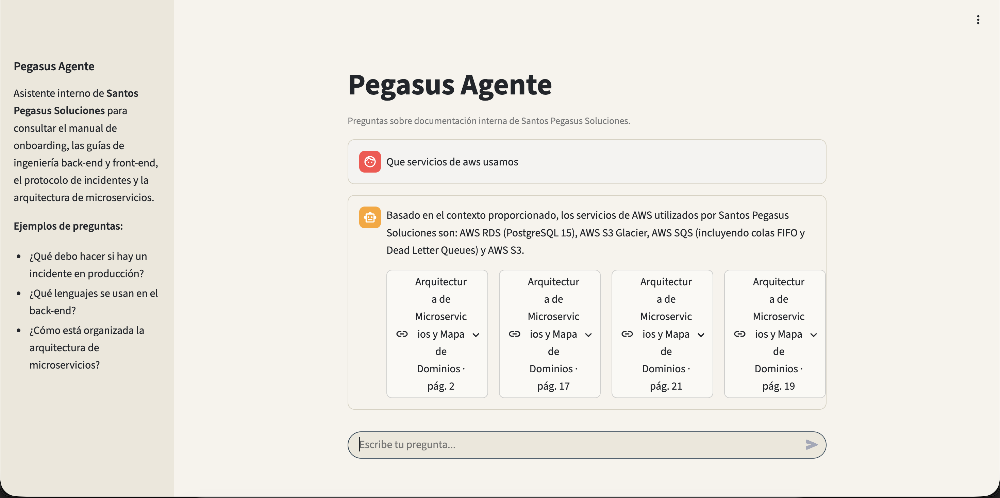
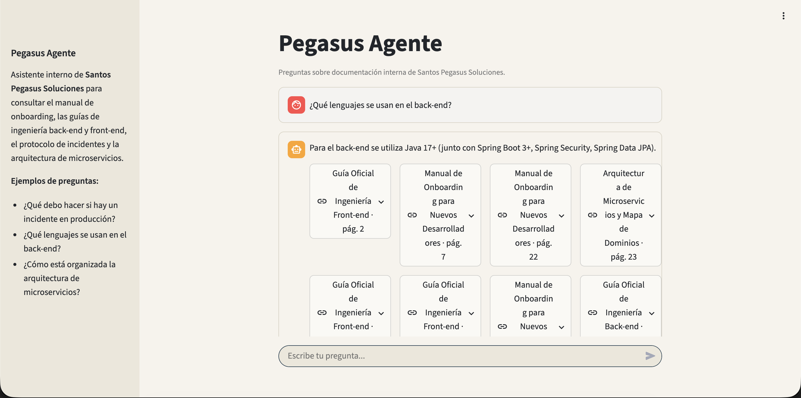
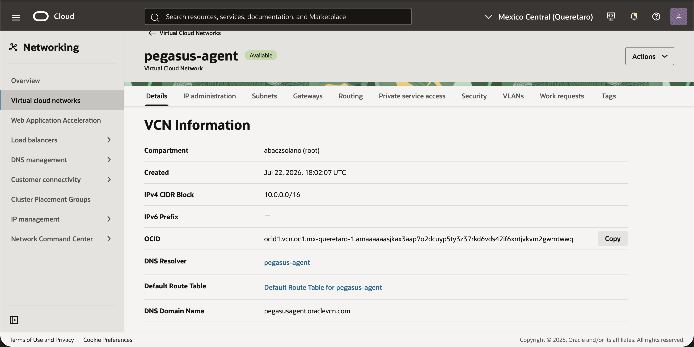
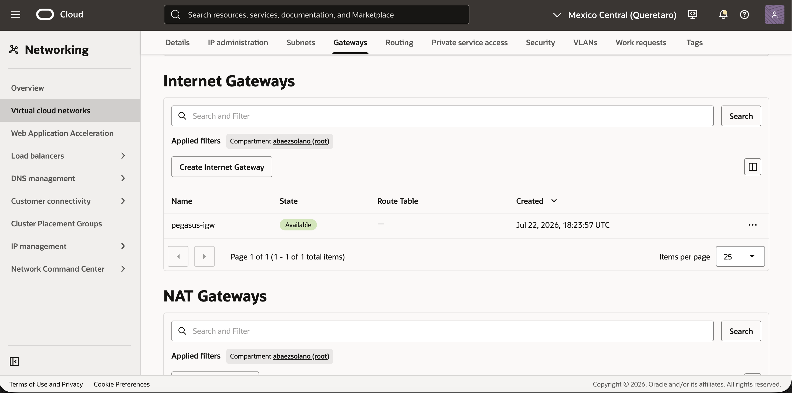
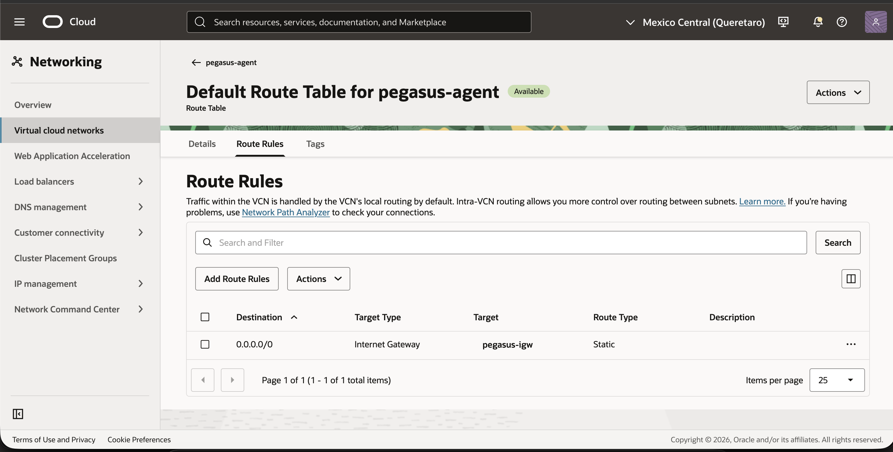
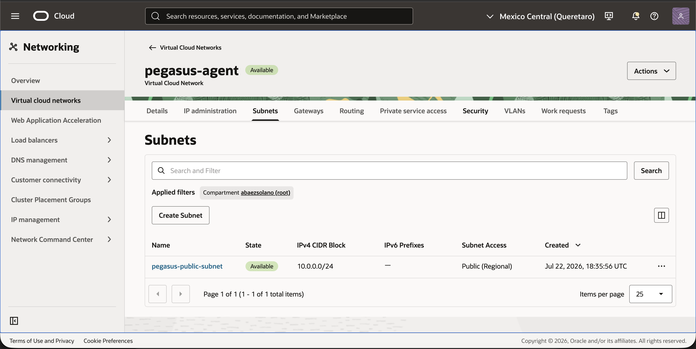
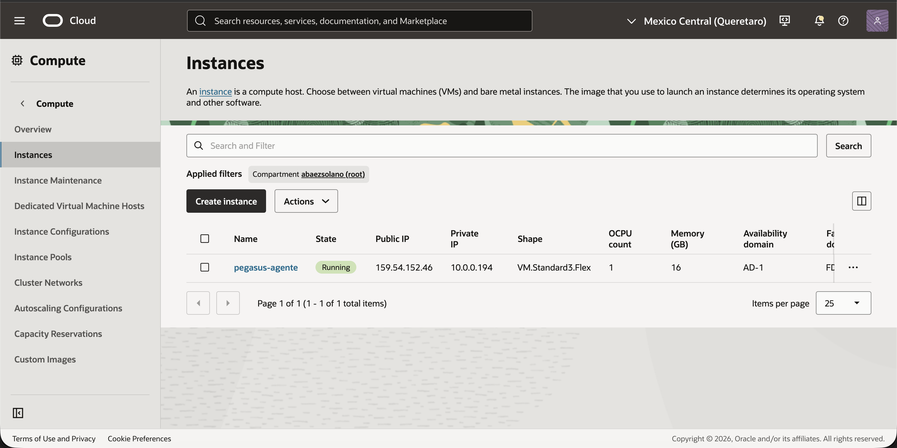

# Pegasus Agente

Agente de inteligencia artificial (RAG) para consultar la documentación interna
de **Santos Pegasus Soluciones**: manual de onboarding, guías de ingeniería
back-end y front-end, protocolo de incidentes y arquitectura de microservicios.

## Arquitectura

- **Ingesta** (`src/ingest.py`): carga los PDFs con `PyMuPDFLoader` y los
  divide en chunks con `RecursiveCharacterTextSplitter` (1000 chars, 150 de
  overlap).
- **Vectorstore** (`src/vectorstore.py`): genera embeddings localmente con
  `HuggingFaceEmbeddings` (`paraphrase-multilingual-MiniLM-L12-v2`, sin costo
  ni límite de requests) y construye un índice FAISS. El índice se persiste en
  `data/faiss_index/` — se calcula una sola vez y queda commiteado en el repo;
  tanto en local como en el deploy se carga directo desde disco, sin volver a
  generar embeddings. Expone un retriever de similitud (`k=10`); la relevancia
  final la decide el LLM según el prompt.
- **Agente** (`src/chain.py`): arma una cadena LCEL
  (`create_stuff_documents_chain`) con Gemini y un `JsonOutputParser` para que
  la respuesta siempre llegue en el formato:
  ```json
  {
    "pregunta": "...",
    "respuesta": "...",
    "citaciones": ["archivo1.pdf", "archivo2.pdf"],
    "documentos_encontrados": true
  }
  ```
- **Frontend** (`app.py`): interfaz de chat en Streamlit, con historial de
  conversación y citas de fuente visibles bajo cada respuesta.

## Tecnologías

Python, LangChain (`langchain-classic`, `langchain-google-genai`), FAISS,
PyMuPDF, Gemini (`gemini-flash-lite-latest`), Streamlit, HuggingFaceEmbeddings

## Cómo ejecutarlo localmente

```bash
python -m venv .venv
source .venv/bin/activate
pip install -r requirements.txt
cp .env.example .env   # agrega tu GEMINI_API_KEY
streamlit run app.py
```

La primera vez que se ejecuta, se leen los PDFs de `data/docs/` y se construye
el índice FAISS (puede tardar unos segundos); las siguientes ejecuciones
cargan el índice ya guardado en `data/faiss_index/`.

## Ejemplos de preguntas y respuestas







## Deploy

Corre en una instancia OCI Compute (Always Free). Pasos resumidos (ver
`deploy/run.sh` y `deploy/pegasus-agente.service`):

1. Cree una instancia Always Free (Ubuntu, VM.Standard.E2.1.Micro o Ampere A1)
   en la consola de OCI y abri el puerto `8501` en la Security List/NSG de la
   VCN.
2. Hice SSH a la instancia, instale `git`, `python3-venv` y clone el repo.
3. `python3 -m venv .venv && source .venv/bin/activate && pip install -r requirements.txt`
4. Se creo `.env` con `GEMINI_API_KEY` y `data/faiss_index/`
   ya viene commiteado, así que no se vuelve a generar en el servidor.
5. Copie `deploy/pegasus-agente.service` a `/etc/systemd/system/`

   ```bash
   sudo cp deploy/pegasus-agente.service /etc/systemd/system/
   sudo systemctl daemon-reload
   sudo systemctl enable --now pegasus-agente
   ```
6. Se puede visitar en  `http://<ip-pública-de-la-instancia>:8501` en el navegador.

### Recursos de OCI utilizados

- **VCN (Virtual Cloud Network):** la red privada propia dentro de OCI donde
  vive la instancia. Sin ella no hay dónde colocar el servidor.

  

- **Internet Gateway:** la "puerta" que conecta la VCN con internet. Sin esto,
  la VCN queda aislada aunque tenga subnet pública.

  

- **Route Table:** las reglas de enrutamiento; le dice a la VCN "todo el
  tráfico a `0.0.0.0/0` (internet) sale por el Internet Gateway".

  

- **Subnet pública:** el segmento de red dentro de la VCN donde vive la
  instancia, configurado para poder recibir una IP pública.

  

- **Security List / NSG:** el firewall a nivel de red de OCI; sin abrir el
  puerto `8501` aquí, nadie de fuera puede llegar a Streamlit aunque el
  servidor esté corriendo.
- **Instancia Compute:** la VM en sí (Ubuntu) donde corre el código.

  

- **`pegasus-agente.service` (systemd):** mantiene Streamlit corriendo en
  segundo plano y lo reinicia solo si se cae o si la VM se reinicia — sin
  esto, el server muere al cerrar la sesión SSH.

### Evidencia del deploy

**Link público:** http://159.54.152.46:8501

